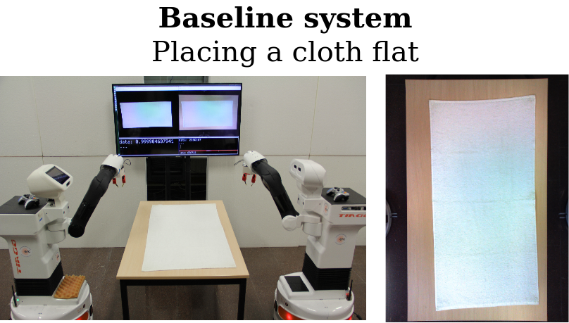
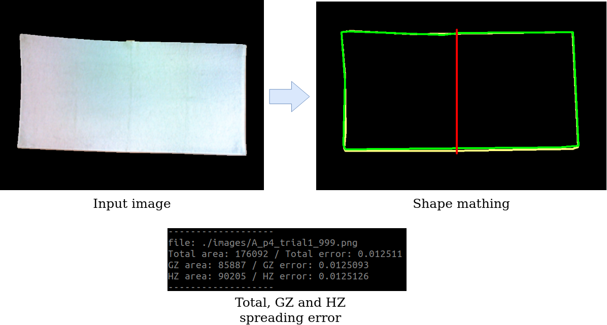
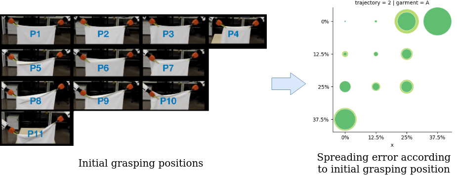

Institut de Robòtica i Informàtica Industrial, CSIC-UPC. Author Irene Garcia-Camacho (igarcia@iri.upc.edu). Repository used for the article **"Benchmarking cloth manipulation using action graphs: an example in placing flat"**.

# Placing Benchmark Metrics

This respository includes the necessary packages to benchmark a common bimanual cloth manipulation task as placing a cloth flat on top of a table.

  

 It includes three packages which autnomously segmentates the spread cloth and gives an insight of the placement error, computes the spreading error of the entire cloth and the error of two different zones of the garment (grasping zone and hanging zone) and plots the obtained results in a visible way to distinguish in a simple glanze how the initial grasing position affects to the task result.
 
This repository includes three packages:

- **image_difference**: C++/ROS package to segment garments through image difference.
- **placing_metrics**: C++ package that computes the placing error of the garment.
- **plots**: Python scrip to plot the baseline results.

Each of the packages include a README file with instructions on how to build and execute them with examples of the expected results. They also provide example files (images or csv data files) of real results of the implemented baseline to test the packages.

## Getting started

For obtaining the segmented images use the package **image_difference** using an RGB camera to take zenith images of the placement result. 

  

For obtaining the spreading results according to the benchmark metrics proposed in the article use the package **placing_metrics** using the images saved with the previous package. It will provide the spreading error of the entire cloth as well of the error in the grasping zone (GZ) and the hanging zone (HZ).

  

For visualizing the obtained results in a visible way use the package **plots** which will plot the spreading error of the entire garment and for GZ and HZ accoding to the initial grasping position.

  

