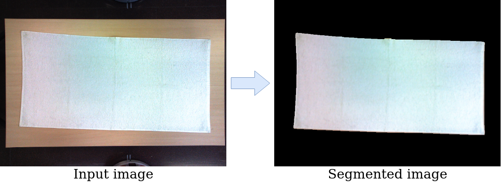

Institut de Robòtica i Informàtica Industrial, CSIC-UPC. Authors Pablo Salido Luis-Ravelo and Irene Garcia-Camacho (igarcia@iri.upc.edu).

# Garment segmentation by image difference

This repository is a ROS package in C++ used for segmentating garments placed on a table from its background using image difference. It is only necessary a RGB camera without depth information. The segmented image is published in a ROS topic or can be saved as a png file in the desired path.

<p align="center">
  
</p>


## Execution

Set the parameters corresponding to your camera in the launch file */launch/xs_camera.launch*, then build the package and launch it.

```
roscd
cd ..
catkin_make --only-pkg-with-deps image_difference
roslaunch image_difference xs_camera.launch
``` 

Run the node:

``rosrun image_difference image_diff.py``

To display the camera view and the segmented image run:
``rosrun rqt_image_view rqt_image_view``

- The topic **/xs/image_raw** displays the camera image
- The topic **/image_difference/successfulplacement_image** displays the segmented image taken of a good placement of the garment
- The topic **/image_difference/current_image** displays the urrent segmented image of the garment

To control and configure the node parameters run:

``rosrun rqt_reconfigure rqt_reconfigure``

The reconfigure includes the following variables:
- **take_picture_table**: Takes the current image as background to which make the image difference.
- **successful_placement**: Saves the current segmented image as the successful placement (it will take into account the total number of pixels of the garment).
- **save_current_img**: Saves the segmented image published in /image_difference/current/image as png in the directory where it is running the node.
- **threshold**, **kernel_x**, **kernel_y**, **dilate_iter**, **erode_iter**: segmentation variables.


## Usage

Having the camera placed to take zenith images of the table, press the boolean **take_picture_table** to save an image of the background. Then place the cloth fully spread on the table and press the boolean **successful_placement** to consider the current state as a template of a successful placement.

Once this is done the node will publish the area of the current cloth state (topic **/image_difference/pixelscurrent**), the area of the saved template (topic **/image_difference/pixelstotal**) and the difference between both areas (topic **/image_difference/error**).

The images saved with this respository can then be used in the repository "placing_metrics".
