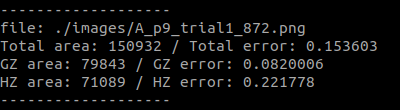

Institut de Robòtica i Informàtica Industrial, CSIC-UPC. Author Irene Garcia-Camacho (igarcia@iri.upc.edu).

# Placing metrics

This repository is a C++ package for computing the placing error of a spread garment performing shape matching with a predefined template  through contour extraction, using zenith images of the cloth on top of the table. 

<p align="center">
  
</p>

## Usage

In first place, it is necessary to place the segmented images of your baseline results, including the image of a successful placement that it is desired to be used as template, in the folder */images*. Note that in this repository we include some images of real results of our baseline system as examples. Then, it is necessary to build the repository:

```
mkdir build
cd build
cmake ..
make
```

To execute it, run in the root of the repository:

``./bin/placing_metrics``

It will display the input segmented image and its contour in green with the template's contour in yellow. The two zones of the cloth, defined as grasping zone (HZ) and hanging zone (HZ) are divided with a red line. It will also create a csv file with the spreading error for the entire cloth and for each zone, which are also printed on the terminal.

<p align="center">
  
</p>
